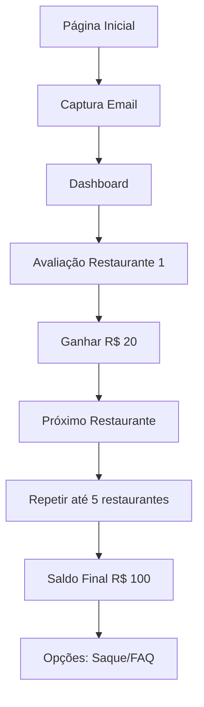

# Documento de Design - Análise do Projeto iFood Benefícios

## Visão Geral

Este documento apresenta o design para uma análise abrangente do projeto "iFood Benefícios", uma aplicação web que simula uma plataforma de avaliação de restaurantes com sistema de gamificação. A análise será estruturada para fornecer insights técnicos, arquiteturais e de negócio que permitam melhor compreensão, manutenção e evolução do sistema.

## Arquitetura da Análise

### Estrutura de Documentação

A análise será organizada em múltiplos documentos especializados:

```
análise-projeto/
├── 01-visao-geral-sistema.md          # Resumo executivo e contexto
├── 02-arquitetura-tecnica.md          # Componentes técnicos e estrutura
├── 03-funcionalidades-usuario.md      # Features e experiência do usuário
├── 04-analise-codigo.md               # Qualidade, padrões e débito técnico
├── 05-gamificacao-engajamento.md      # Estratégias de retenção e UX
├── 06-guia-operacional.md             # Deploy, manutenção e troubleshooting
└── 07-recomendacoes-melhorias.md      # Sugestões de otimização
```

### Metodologia de Análise

#### Fase 1: Descoberta e Mapeamento
- **Análise estática do código**: Exame de todos os arquivos fonte
- **Mapeamento de fluxos**: Identificação de jornadas do usuário
- **Inventário de assets**: Catalogação de recursos e dependências
- **Análise de configurações**: Revisão de scripts e configurações

#### Fase 2: Análise Técnica Profunda
- **Arquitetura de componentes**: Relacionamentos e dependências
- **Padrões de código**: Identificação de práticas e anti-padrões
- **Performance e segurança**: Avaliação de gargalos e vulnerabilidades
- **Escalabilidade**: Limitações e oportunidades de crescimento

#### Fase 3: Análise de Negócio
- **Estratégia de gamificação**: Mecânicas de engajamento
- **Experiência do usuário**: Fluxos e pontos de fricção
- **Métricas e analytics**: Dados coletados e insights possíveis
- **Oportunidades de otimização**: Melhorias de conversão e retenção

## Componentes da Análise

### 1. Análise Arquitetural

#### Frontend
- **Estrutura de páginas**: Mapeamento de todas as rotas e componentes
- **Sistema de estilos**: Organização CSS, responsividade e temas
- **JavaScript**: Lógica de negócio, validações e interações
- **Assets**: Imagens, fontes, sons e otimizações

#### Backend
- **Servidor HTTP**: Implementação Python customizada
- **Roteamento**: Sistema de URLs e redirecionamentos
- **Servir arquivos**: Estratégia de assets estáticos
- **Configurações**: Scripts de inicialização e manutenção

#### Persistência
- **LocalStorage**: Dados do usuário e progresso
- **Sessão**: Gerenciamento de estado temporário
- **Configurações**: Valores hardcoded vs configuráveis

### 2. Análise Funcional

#### Fluxo Principal


#### Componentes de Gamificação
- **Sistema de recompensas**: Valores, progressão e feedback
- **Elementos visuais**: Animações, cores e feedback visual
- **Mecânicas de engajamento**: Validações, progressão forçada
- **Feedback auditivo**: Sons de sucesso e conclusão

### 3. Análise de Qualidade

#### Métricas de Código
- **Complexidade**: Funções, aninhamento e manutenibilidade
- **Duplicação**: Código repetido e oportunidades de refatoração
- **Padrões**: Consistência de nomenclatura e estrutura
- **Documentação**: Comentários e clareza do código

#### Segurança
- **Validação de entrada**: Sanitização e validação de dados
- **Exposição de dados**: Informações sensíveis no frontend
- **Configurações**: Hardcoding vs variáveis de ambiente
- **Dependências**: Vulnerabilidades em bibliotecas externas

#### Performance
- **Carregamento**: Otimização de assets e lazy loading
- **Renderização**: Eficiência do DOM e reflows
- **Memória**: Vazamentos e gerenciamento de recursos
- **Rede**: Compressão, cache e CDN

## Interfaces e Componentes

### Sistema de Documentação

#### Template de Análise
```markdown
# [Componente/Funcionalidade]

## Descrição
[Descrição detalhada do que faz]

## Implementação Atual
[Como está implementado hoje]

## Pontos Fortes
[O que funciona bem]

## Pontos de Melhoria
[O que pode ser otimizado]

## Recomendações
[Sugestões específicas]

## Impacto
[Prioridade e esforço estimado]
```

#### Categorização de Problemas
- **Crítico**: Problemas de segurança ou funcionalidade
- **Alto**: Impacto significativo na UX ou manutenção
- **Médio**: Melhorias de qualidade ou performance
- **Baixo**: Otimizações menores ou cosméticas

### Ferramentas de Análise

#### Análise Estática
- **Linting**: Verificação de padrões JavaScript/CSS
- **Complexidade**: Métricas de código e manutenibilidade
- **Dependências**: Auditoria de segurança e atualizações
- **Performance**: Análise de bundle size e otimizações

#### Análise Dinâmica
- **Lighthouse**: Performance, acessibilidade, SEO
- **DevTools**: Profiling de performance e memória
- **Testes manuais**: Fluxos de usuário e edge cases
- **Compatibilidade**: Testes cross-browser

## Modelos de Dados

### Estrutura de Avaliação
```javascript
{
  usuario: {
    email: string,
    saldo: number,
    progresso: {
      restauranteAtual: number,
      avaliacoesCompletas: number,
      dadosAvaliacoes: {
        [restaurante]: {
          nota: number,
          recomendacao: boolean,
          preferencia: string,
          timestamp: Date
        }
      }
    }
  }
}
```

### Configuração do Sistema
```javascript
{
  restaurantes: [
    {
      id: string,
      nome: string,
      imagem: string,
      perguntas: [
        {
          tipo: 'rating' | 'choice',
          texto: string,
          opcoes: string[]
        }
      ],
      recompensa: number
    }
  ],
  configuracoes: {
    saldoInicial: number,
    recompensaPorAvaliacao: number,
    totalRestaurantes: number
  }
}
```

## Tratamento de Erros

### Categorias de Erro
1. **Erros de Validação**: Formulários incompletos ou inválidos
2. **Erros de Estado**: Inconsistências no localStorage ou sessão
3. **Erros de Rede**: Falhas no carregamento de assets
4. **Erros de Compatibilidade**: Problemas cross-browser

### Estratégia de Logging
- **Erros críticos**: Console.error com stack trace
- **Avisos**: Console.warn para situações não ideais
- **Debug**: Console.log para desenvolvimento (removível em produção)
- **Analytics**: Tracking de erros para monitoramento

## Estratégia de Testes

### Testes Manuais
- **Fluxo completo**: Do email até conclusão das avaliações
- **Edge cases**: Dados inválidos, navegação atípica
- **Responsividade**: Diferentes tamanhos de tela
- **Compatibilidade**: Múltiplos navegadores e dispositivos

### Testes Automatizados (Recomendação Futura)
- **Unit tests**: Funções JavaScript críticas
- **Integration tests**: Fluxos de usuário principais
- **E2E tests**: Jornada completa do usuário
- **Performance tests**: Métricas de carregamento

## Considerações de Deployment

### Ambiente Local
- **Requisitos**: Python 3.x, navegador moderno
- **Inicialização**: Scripts automatizados (start.sh)
- **Desenvolvimento**: Hot reload e debugging

### Produção (Recomendações)
- **Servidor web**: Nginx ou Apache para assets estáticos
- **HTTPS**: Certificado SSL obrigatório
- **Compressão**: Gzip para assets
- **Cache**: Headers apropriados para performance
- **Monitoramento**: Logs de acesso e erro

## Métricas e Monitoramento

### KPIs Técnicos
- **Tempo de carregamento**: First Contentful Paint, Time to Interactive
- **Taxa de erro**: JavaScript errors, failed requests
- **Compatibilidade**: Browser support, mobile usage
- **Performance**: Bundle size, asset optimization

### KPIs de Negócio
- **Taxa de conversão**: Email → Primeira avaliação
- **Taxa de conclusão**: Avaliações completas vs iniciadas
- **Tempo de sessão**: Duração média no site
- **Abandono**: Pontos onde usuários saem do fluxo

Este design fornece uma estrutura abrangente para analisar todos os aspectos do projeto iFood Benefícios, desde a arquitetura técnica até as estratégias de negócio, permitindo identificar oportunidades de melhoria e otimização.