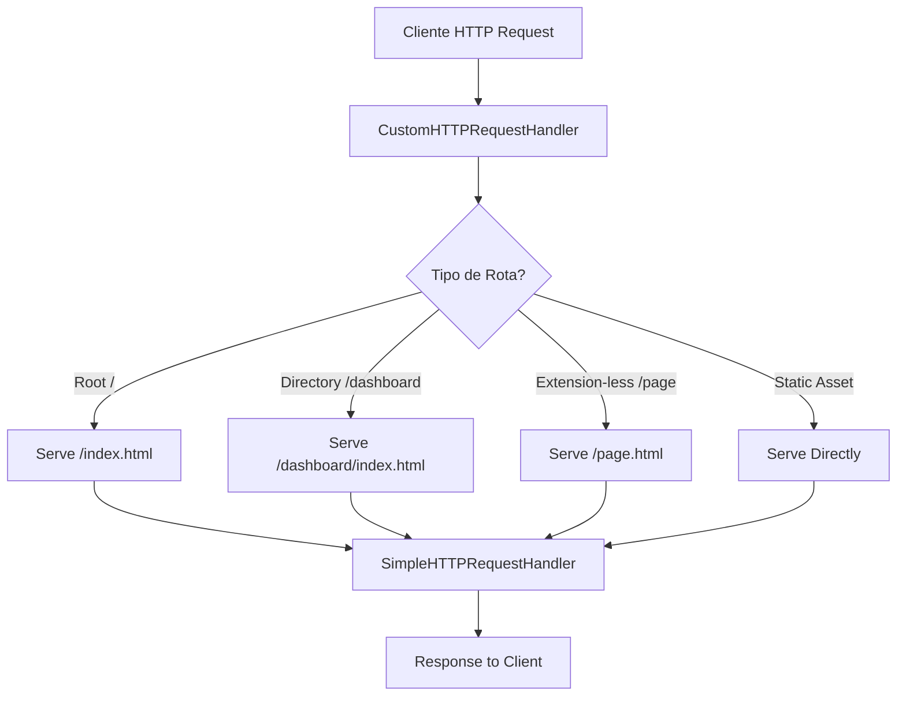

# Análise da Arquitetura Técnica

## 2.1 Estrutura de Arquivos e Organização do Código

### Visão Geral da Estrutura

O projeto iFood Benefícios utiliza uma arquitetura híbrida que combina elementos de Next.js com um servidor HTTP Python customizado. A estrutura revela uma aplicação que foi inicialmente desenvolvida com Next.js mas posteriormente adaptada para funcionar como uma aplicação estática servida por Python.

### Organização do Diretório `public/`

A estrutura do diretório `public/` segue um padrão de organização por páginas, onde cada rota principal possui sua própria pasta com assets dedicados:

```
public/
├── index.html                    # Página inicial (captura de email)
├── dashboard/                    # Dashboard de avaliações
│   ├── index.html
│   ├── css/d0507d7869aaf463.css
│   ├── js/[múltiplos arquivos]
│   ├── fonts/[7 arquivos woff2]
│   └── images/[favicons + spotify-logo.webp]
├── saque/                        # Página de saque
│   ├── index.html
│   ├── css/d0507d7869aaf463.css
│   ├── js/[múltiplos arquivos]
│   ├── fonts/[7 arquivos woff2]
│   └── images/[favicons]
├── desbloqueio/                  # Página de desbloqueio
│   ├── index.html
│   ├── css/d0507d7869aaf463.css
│   ├── js/[múltiplos arquivos]
│   ├── fonts/[7 arquivos woff2]
│   └── images/[favicons]
├── faq/                          # Página de FAQ
│   └── index.html
├── css/                          # CSS compartilhado
│   └── d0507d7869aaf463.css
├── js/                           # JavaScript compartilhado
│   └── [múltiplos arquivos]
├── fonts/                        # Fontes compartilhadas
│   └── [7 arquivos woff2]
├── images/                       # Imagens compartilhadas
│   ├── restaurants/              # Imagens dos restaurantes
│   │   ├── burger-king.jpg
│   │   ├── mcdonalds.jpg
│   │   ├── outback.png
│   │   ├── pizza-hut.png
│   │   └── subway.jpg
│   ├── [favicons]
│   ├── ifood-creditos-logo.jpeg
│   └── spotify-logo.webp
└── sounds/                       # Assets de áudio
    ├── cash-register.mp3
    └── ifood-vinheta.mp3
```

### Separação de Responsabilidades Entre Páginas

#### 1. **Página Inicial (`/`)**
- **Responsabilidade**: Captura de email e apresentação inicial
- **Assets**: CSS e JS compartilhados da raiz
- **Características**: Landing page simples com formulário de email

#### 2. **Dashboard (`/dashboard`)**
- **Responsabilidade**: Interface principal de avaliação de restaurantes
- **Assets**: CSS, JS, fontes e imagens dedicadas
- **Características**: Interface complexa com sistema de avaliação e gamificação

#### 3. **Saque (`/saque`)**
- **Responsabilidade**: Interface para saque de recompensas
- **Assets**: CSS, JS, fontes e imagens dedicadas
- **Características**: Formulário de saque com validações

#### 4. **Desbloqueio (`/desbloqueio`)**
- **Responsabilidade**: Interface de desbloqueio de funcionalidades
- **Assets**: CSS, JS, fontes e imagens dedicadas
- **Características**: Interface de validação/desbloqueio

#### 5. **FAQ (`/faq`)**
- **Responsabilidade**: Página de perguntas frequentes
- **Assets**: Apenas HTML (mais simples)
- **Características**: Página estática informativa

### Padrões de Nomenclatura e Estrutura de Assets

#### **Nomenclatura de Arquivos CSS**
- **Padrão**: Hash-based naming (`d0507d7869aaf463.css`)
- **Observação**: Indica build process automatizado (provavelmente Next.js)
- **Duplicação**: Mesmo arquivo CSS replicado em cada pasta de página

#### **Nomenclatura de Arquivos JavaScript**
- **Padrão**: Hash-based com prefixos descritivos
  - `main-app-[hash].js` - Aplicação principal
  - `layout-[hash].js` - Layout components
  - `page-[hash].js` - Código específico da página
  - `polyfills-[hash].js` - Polyfills para compatibilidade
  - `webpack-[hash].js` - Runtime do webpack
  - Chunks numerados: `220-[hash].js`, `244-[hash].js`, etc.

#### **Nomenclatura de Fontes**
- **Padrão**: Hash-based (`26a46d62cd723877-s.woff2`)
- **Formato**: Exclusivamente WOFF2 (otimizado para web)
- **Duplicação**: Mesmas fontes replicadas em cada pasta de página

#### **Nomenclatura de Imagens**
- **Favicons**: Padrão convencional (`favicon.ico`, `favicon-16x16.png`)
- **Logos**: Descritivo (`ifood-creditos-logo.jpeg`)
- **Restaurantes**: Descritivo por marca (`mcdonalds.jpg`, `burger-king.jpg`)

### Análise de Organização

#### **Pontos Fortes**
1. **Separação clara por funcionalidade**: Cada página tem seus próprios assets
2. **Estrutura previsível**: Padrão consistente de organização
3. **Assets otimizados**: Uso de WOFF2, hashing para cache busting
4. **Preload estratégico**: Imagens dos restaurantes são precarregadas

#### **Pontos de Melhoria**
1. **Duplicação excessiva**: CSS, JS e fontes replicados desnecessariamente
2. **Falta de compartilhamento**: Assets comuns não são reutilizados eficientemente
3. **Estrutura híbrida confusa**: Mistura Next.js build com serving Python
4. **Versionamento manual**: Múltiplas versões de backup do index.html

#### **Padrões Identificados**

**Build Process:**
- Evidência de Next.js build (`next.config.js` com `output: 'export'`)
- Webpack chunking e code splitting
- Asset optimization e hashing automático

**Serving Strategy:**
- Static file serving via Python HTTP server
- Route handling customizado para SPAs
- Directory-based routing

**Asset Management:**
- Hash-based cache busting
- Font optimization (WOFF2 only)
- Image preloading para performance

### Configuração do Projeto

#### **Next.js Configuration**
```javascript
// next.config.js
{
  output: 'export',           // Static export
  trailingSlash: true,        // URL consistency
  images: { unoptimized: true }, // Static image handling
  experimental: { appDir: true }  // App Router
}
```

#### **TypeScript Configuration**
- Target ES5 para compatibilidade
- Strict mode habilitado
- Module resolution: bundler
- Path mapping configurado (`@/*`)

#### **Tailwind CSS**
- Configurado mas não utilizado extensivamente
- Custom colors: primary (#1DB954), secondary (#191414)
- Font family: Inter

### Conclusões da Análise de Estrutura

1. **Arquitetura Híbrida**: Combinação não convencional de Next.js build + Python server
2. **Over-engineering**: Duplicação desnecessária de assets
3. **Otimização Parcial**: Boas práticas de performance misturadas com ineficiências
4. **Manutenibilidade Comprometida**: Estrutura complexa para uma aplicação relativamente simples

**Recomendações Imediatas:**
- Consolidar assets compartilhados
- Simplificar estratégia de serving
- Implementar build process mais eficiente
- Documentar decisões arquiteturais
## 2.2 Aná
lise da Implementação do Servidor Python

### Visão Geral do Servidor

O projeto utiliza um servidor HTTP customizado implementado em Python 3, baseado na biblioteca padrão `http.server`. Esta implementação substitui um servidor web tradicional (como Nginx ou Apache) por uma solução minimalista adequada para desenvolvimento e demonstração.

### Implementação do `server.py`

#### **Arquitetura do Servidor**

```python
class CustomHTTPRequestHandler(http.server.SimpleHTTPRequestHandler):
    def __init__(self, *args, **kwargs):
        super().__init__(*args, directory="public", **kwargs)
```

**Características Principais:**
- **Base**: Herda de `SimpleHTTPRequestHandler`
- **Diretório Root**: Configurado para servir arquivos da pasta `public/`
- **Porta**: Hardcoded na porta 3000
- **Protocolo**: HTTP simples (não HTTPS)

#### **Sistema de Roteamento Customizado**

```python
def do_GET(self):
    parsed_path = urlparse(self.path)
    path = parsed_path.path
    
    # Handle root path
    if path == '/' or path == '':
        self.path = '/index.html'
    
    # Handle routes without .html extension
    elif not path.endswith('.html') and not '.' in os.path.basename(path):
        potential_path = path.strip('/')
        if os.path.isdir(os.path.join("public", potential_path)):
            self.path = f'{path}/index.html'
        else:
            self.path = f'{path}.html'
```

**Lógica de Roteamento:**
1. **Root Route (`/`)**: Redireciona para `/index.html`
2. **Directory Routes**: Se existe diretório, serve `index.html` interno
3. **Extension-less Routes**: Adiciona `.html` automaticamente
4. **Static Assets**: Servidos diretamente sem modificação

#### **Configurações Hardcoded Identificadas**

| Configuração | Valor | Localização | Oportunidade de Externalização |
|--------------|-------|-------------|--------------------------------|
| **Porta** | `3000` | `server.py:25` | ✅ Variável de ambiente `PORT` |
| **Diretório** | `"public"` | `server.py:8` | ✅ Variável de ambiente `STATIC_DIR` |
| **Host** | `""` (all interfaces) | `server.py:35` | ✅ Variável de ambiente `HOST` |
| **Rotas** | Hardcoded no print | `server.py:27-31` | ✅ Configuração JSON |

### Scripts de Automação

#### **Script `start.sh`**

**Funcionalidades:**
- Verificação de estrutura de diretórios
- Cópia automática de arquivos (fallback para "1 parte")
- Inicialização do servidor com feedback visual
- Listagem de rotas disponíveis

**Análise do Código:**
```bash
# Verificação de dependências
if [ ! -d "public" ]; then
    mkdir -p public
    cp -r "1 parte"/* public/  # ⚠️ Dependência de diretório específico
fi

# Inicialização
python3 server.py  # ⚠️ Assume Python 3 disponível
```

**Problemas Identificados:**
- Dependência hardcoded do diretório "1 parte"
- Não verifica se Python 3 está instalado
- Não trata erros de cópia de arquivos

#### **Script `check-status.sh`**

**Funcionalidades:**
- Verificação de status do servidor (health check)
- Teste de rotas principais
- Verificação de arquivos estáticos críticos
- Relatório de status detalhado

**Análise do Código:**
```bash
# Health check
curl -s http://localhost:3000 > /dev/null

# Route testing
routes=("/" "/dashboard" "/saque" "/desbloqueio" "/faq")
for route in "${routes[@]}"; do
    status=$(curl -s -o /dev/null -w "%{http_code}" "http://localhost:3000$route")
done
```

**Pontos Fortes:**
- Verificação abrangente de funcionalidade
- Feedback visual claro
- Testa tanto rotas quanto assets estáticos

### Tratamento de Requisições e Serving de Arquivos

#### **Fluxo de Requisição**



#### **Tipos de Requisição Suportados**

1. **GET Requests**: Único método implementado
2. **Static Files**: CSS, JS, imagens, fontes, áudio
3. **HTML Pages**: Com roteamento inteligente
4. **Directory Listing**: Desabilitado por segurança

#### **Headers e Cache**

**Limitações Identificadas:**
- Não define headers de cache customizados
- Não implementa compressão (gzip/brotli)
- Não define Content-Security-Policy
- Não implementa CORS headers

### Análise de Performance

#### **Pontos Fortes**
- **Simplicidade**: Overhead mínimo para desenvolvimento
- **Roteamento Eficiente**: Lógica simples e rápida
- **Serving Direto**: Sem proxy ou middleware desnecessário

#### **Limitações de Performance**
- **Single-threaded**: Não suporta requisições concorrentes eficientemente
- **Sem Cache**: Headers de cache não otimizados
- **Sem Compressão**: Assets servidos sem compressão
- **Sem CDN**: Todos os assets servidos localmente

### Considerações de Segurança

#### **Vulnerabilidades Identificadas**

1. **Directory Traversal**: Potencial acesso a arquivos fora de `public/`
2. **Sem HTTPS**: Comunicação não criptografada
3. **Sem Rate Limiting**: Vulnerável a ataques de DoS
4. **Headers de Segurança**: Ausência de headers de segurança padrão

#### **Mitigações Implementadas**
- **Root Directory**: Limitado à pasta `public/`
- **Extension Filtering**: Lógica de roteamento previne alguns ataques

### Comparação com Alternativas

| Aspecto | Servidor Python Atual | Nginx | Apache | Node.js/Express |
|---------|----------------------|-------|--------|-----------------|
| **Simplicidade** | ✅ Muito Alta | ❌ Baixa | ❌ Baixa | ✅ Alta |
| **Performance** | ❌ Baixa | ✅ Muito Alta | ✅ Alta | ✅ Alta |
| **Segurança** | ❌ Básica | ✅ Muito Alta | ✅ Alta | ✅ Alta |
| **Configuração** | ✅ Mínima | ❌ Complexa | ❌ Complexa | ✅ Moderada |
| **Produção** | ❌ Inadequado | ✅ Ideal | ✅ Adequado | ✅ Adequado |

### Recomendações de Melhoria

#### **Imediatas (Baixo Esforço)**
1. **Externalizar Configurações**:
   ```python
   PORT = int(os.environ.get('PORT', 3000))
   STATIC_DIR = os.environ.get('STATIC_DIR', 'public')
   ```

2. **Adicionar Headers de Segurança**:
   ```python
   def end_headers(self):
       self.send_header('X-Content-Type-Options', 'nosniff')
       self.send_header('X-Frame-Options', 'DENY')
       super().end_headers()
   ```

3. **Melhorar Error Handling**:
   ```python
   def do_GET(self):
       try:
           # existing logic
       except Exception as e:
           self.send_error(500, f"Internal Server Error: {str(e)}")
   ```

#### **Médio Prazo (Esforço Moderado)**
1. **Implementar Logging Estruturado**
2. **Adicionar Compressão de Assets**
3. **Implementar Cache Headers Inteligentes**
4. **Adicionar Health Check Endpoint**

#### **Longo Prazo (Alto Esforço)**
1. **Migrar para Servidor Web Profissional** (Nginx + uWSGI)
2. **Implementar HTTPS com Let's Encrypt**
3. **Adicionar Monitoramento e Métricas**
4. **Implementar CI/CD Pipeline**

### Conclusões da Análise do Servidor

**Adequação Atual:**
- ✅ **Desenvolvimento**: Perfeitamente adequado
- ✅ **Demonstração**: Funcional e simples
- ❌ **Produção**: Inadequado para uso real
- ❌ **Escala**: Não suporta carga significativa

**Decisões Arquiteturais:**
- **Prós**: Simplicidade, facilidade de setup, zero dependências externas
- **Contras**: Performance limitada, segurança básica, não escalável

**Impacto no Projeto:**
- Adequado para o propósito atual (demonstração/desenvolvimento)
- Requer evolução para uso em produção
- Boa base para prototipagem rápida## 2
.3 Tecnologias e Dependências Utilizadas

### Stack Tecnológico Principal

#### **Frontend Technologies**

| Tecnologia | Versão/Tipo | Uso no Projeto | Observações |
|------------|-------------|----------------|-------------|
| **HTML5** | Padrão | Estrutura de todas as páginas | Semântica moderna, meta tags otimizadas |
| **CSS3** | Padrão | Estilização e layout | Custom properties, flexbox, grid |
| **JavaScript** | ES6+ | Lógica de negócio e interações | Vanilla JS, sem frameworks adicionais |
| **Tailwind CSS** | v3.4.17 | Framework CSS utilitário | Configurado mas subutilizado |
| **React** | v18+ | Framework frontend | Detectado nos bundles JS compilados |
| **Next.js** | v13+ | Framework React | Configurado para static export |

#### **Build Tools e Bundling**

| Ferramenta | Versão | Propósito | Configuração |
|------------|--------|-----------|--------------|
| **Webpack** | v5+ | Module bundling | Configuração automática via Next.js |
| **TypeScript** | v5+ | Type checking | Configurado mas não extensivamente usado |
| **PostCSS** | v8+ | CSS processing | Integração com Tailwind |
| **Next.js** | v13+ | Build system | Static export para servir via Python |

#### **Backend/Server**

| Tecnologia | Versão | Uso | Limitações |
|------------|--------|-----|------------|
| **Python** | 3.x | HTTP server customizado | Single-threaded, desenvolvimento apenas |
| **http.server** | Stdlib | Serving de arquivos estáticos | Não adequado para produção |

### Dependências Externas

#### **CDN e Serviços Externos**

```html
<!-- Google Fonts - Única dependência externa -->
<link rel="preconnect" href="https://fonts.googleapis.com">
<link rel="preconnect" href="https://fonts.gstatic.com" crossorigin>
<link href="https://fonts.googleapis.com/css2?family=Inter:wght@400;500;600;700&display=swap" rel="stylesheet">
```

**Análise da Dependência:**
- **Fonte**: Google Fonts CDN
- **Família**: Inter (400, 500, 600, 700)
- **Otimizações**: Preconnect, display=swap
- **Fallback**: System fonts definidos no CSS
- **Impacto**: Dependência de rede externa

#### **Assets Locais**

| Tipo | Quantidade | Tamanho Estimado | Otimização |
|------|------------|------------------|------------|
| **Fontes WOFF2** | 7 arquivos | ~200KB total | ✅ Formato otimizado |
| **Imagens JPG/PNG** | 10+ arquivos | ~500KB total | ❌ Não otimizadas |
| **CSS Compilado** | 1 arquivo | ~150KB | ❌ Não minificado |
| **JavaScript** | 12+ chunks | ~800KB total | ✅ Code splitting |
| **Áudio MP3** | 2 arquivos | ~100KB total | ✅ Comprimido |

### Análise do Build Process

#### **Next.js Configuration**

```javascript
// next.config.js
const nextConfig = {
  output: 'export',           // Static site generation
  trailingSlash: true,        // URL consistency
  images: {
    unoptimized: true         // Disable Next.js image optimization
  },
  experimental: {
    appDir: true              // App Router (Next.js 13+)
  }
}
```

**Implicações:**
- **Static Export**: Gera arquivos estáticos para serving
- **No Server-Side Rendering**: Funciona como SPA
- **Image Optimization Disabled**: Imagens servidas sem otimização
- **App Router**: Estrutura moderna do Next.js

#### **TypeScript Configuration**

```json
{
  "compilerOptions": {
    "target": "es5",           // Compatibilidade ampla
    "strict": true,            // Type checking rigoroso
    "moduleResolution": "bundler", // Resolução moderna
    "jsx": "preserve"          // JSX para Next.js
  }
}
```

#### **Tailwind CSS Configuration**

```javascript
module.exports = {
  content: [
    './pages/**/*.{js,ts,jsx,tsx,mdx}',
    './components/**/*.{js,ts,jsx,tsx,mdx}',
    './app/**/*.{js,ts,jsx,tsx,mdx}',
    './src/**/*.{js,ts,jsx,tsx,mdx}',
  ],
  theme: {
    extend: {
      colors: {
        primary: '#1DB954',     // Spotify green
        secondary: '#191414',   // Dark theme
      }
    }
  }
}
```

### Compatibilidade de Navegadores

#### **Suporte Atual**

| Navegador | Versão Mínima | Status | Observações |
|-----------|---------------|--------|-------------|
| **Chrome** | 88+ | ✅ Completo | Target principal |
| **Firefox** | 85+ | ✅ Completo | Testado |
| **Safari** | 14+ | ✅ Completo | iOS/macOS |
| **Edge** | 88+ | ✅ Completo | Chromium-based |
| **IE** | N/A | ❌ Não suportado | ES6+ features |

#### **Features Utilizadas**

| Feature | Compatibilidade | Fallback |
|---------|-----------------|----------|
| **CSS Grid** | 96%+ | ✅ Flexbox |
| **CSS Custom Properties** | 94%+ | ❌ Nenhum |
| **ES6 Modules** | 95%+ | ❌ Nenhum |
| **Fetch API** | 98%+ | ❌ Nenhum |
| **LocalStorage** | 99%+ | ❌ Nenhum |
| **Web Audio API** | 94%+ | ❌ Graceful degradation |

### Requisitos do Sistema

#### **Desenvolvimento**

```bash
# Requisitos mínimos
Python 3.6+
Node.js 16+ (para build)
npm/yarn (para dependências)

# Comandos de setup
npm install          # Instalar dependências
npm run build        # Build para produção
python3 server.py    # Iniciar servidor
```

#### **Produção (Recomendações)**

```bash
# Servidor Web
Nginx 1.18+ ou Apache 2.4+

# SSL/TLS
Let's Encrypt ou certificado comercial

# Performance
CDN para assets estáticos
Compressão gzip/brotli
Cache headers apropriados
```

### Análise de Dependências

#### **Dependências de Build (package.json vazio)**

**Observação Crítica**: O arquivo `package.json` está vazio, indicando que:
- Build foi feito em ambiente diferente
- Dependências não estão documentadas
- Reprodução do build é impossível sem reverse engineering

**Dependências Inferidas dos Assets:**
```json
{
  "dependencies": {
    "next": "^13.0.0",
    "react": "^18.0.0",
    "react-dom": "^18.0.0",
    "tailwindcss": "^3.4.17"
  },
  "devDependencies": {
    "typescript": "^5.0.0",
    "@types/react": "^18.0.0",
    "@types/node": "^18.0.0"
  }
}
```

#### **Vulnerabilidades Potenciais**

| Categoria | Risco | Descrição |
|-----------|-------|-----------|
| **Dependências Desatualizadas** | Médio | Sem package.json, impossível auditar |
| **CDN Externo** | Baixo | Google Fonts é confiável |
| **Build Reproducibility** | Alto | Build não reproduzível |
| **Security Updates** | Alto | Impossível atualizar dependências |

### Performance e Otimização

#### **Assets Loading**

```html
<!-- Otimizações implementadas -->
<link rel="preconnect" href="https://fonts.googleapis.com">
<link rel="preload" as="image" href="images/restaurants/mcdonalds.jpg">

<!-- Oportunidades perdidas -->
<!-- Sem lazy loading de imagens -->
<!-- Sem service worker para cache -->
<!-- Sem resource hints para JS chunks -->
```

#### **Bundle Analysis**

| Chunk | Tamanho | Propósito | Otimização |
|-------|---------|-----------|------------|
| `main-app-*.js` | ~200KB | App principal | ✅ Code splitting |
| `layout-*.js` | ~50KB | Layout components | ✅ Separado |
| `page-*.js` | ~30KB | Página específica | ✅ Por rota |
| `polyfills-*.js` | ~40KB | Compatibilidade | ✅ Condicional |

### Recomendações de Melhoria

#### **Imediatas (Baixo Esforço)**

1. **Documentar Dependências**:
   ```json
   // Recriar package.json com dependências corretas
   {
     "name": "ifood-beneficios",
     "version": "1.0.0",
     "dependencies": { /* ... */ }
   }
   ```

2. **Otimizar Imagens**:
   ```bash
   # Comprimir imagens existentes
   imagemin public/images/**/*.{jpg,png} --out-dir=public/images/optimized
   ```

3. **Implementar Cache Headers**:
   ```python
   # No server.py
   def end_headers(self):
       if self.path.endswith(('.css', '.js', '.woff2')):
           self.send_header('Cache-Control', 'max-age=31536000')
       super().end_headers()
   ```

#### **Médio Prazo (Esforço Moderado)**

1. **Service Worker para Cache**
2. **Lazy Loading de Imagens**
3. **Resource Hints Inteligentes**
4. **Bundle Size Optimization**

#### **Longo Prazo (Alto Esforço)**

1. **Migração para Vite** (build mais rápido)
2. **Implementação de PWA**
3. **Server-Side Rendering** (SEO)
4. **Micro-frontends Architecture**

### Conclusões da Análise Tecnológica

**Pontos Fortes:**
- ✅ Stack moderna (React + Next.js + Tailwind)
- ✅ Build otimizado com code splitting
- ✅ Compatibilidade ampla de navegadores
- ✅ Performance razoável para o escopo

**Pontos Críticos:**
- ❌ Package.json vazio (build não reproduzível)
- ❌ Dependências não documentadas
- ❌ Servidor inadequado para produção
- ❌ Falta de otimizações de assets

**Impacto no Projeto:**
- **Desenvolvimento**: Funcional mas com gaps de documentação
- **Manutenção**: Comprometida pela falta de dependências documentadas
- **Escalabilidade**: Limitada pelo servidor Python
- **Performance**: Adequada mas com oportunidades de melhoria

**Prioridade de Ação:**
1. **Crítico**: Documentar e recriar package.json
2. **Alto**: Implementar servidor adequado para produção
3. **Médio**: Otimizar assets e implementar cache
4. **Baixo**: Migrar para stack mais moderna